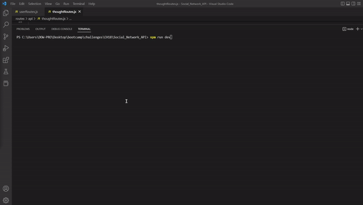

# Social_Network_Api

## Licence

[](https://opensource.org/licenses/MIT)

## Table of Contents

- [Description](#Description)
- [Links](#Links) 
- [Installation](#Installation)
- [Usage](#Usage)
- [Testing](#Testing)
- [Credits](#Credits)
- [Questions](#Questions)

## Description

<br>
I'll be building a an API for a social network web application where users can share their thoughts, react to friends’ thoughts, and create a friend list. You’ll use Express.js for routing, a MongoDB database, and the Mongoose ODM. In addition to using the Express.js Links to an external site.and Mongoose Links to an external site.packages, you may also optionally use a JavaScript date library of your choice or the native JavaScript Date object to format timestamps.

As a social media startup I want an API for my social network that uses a NoSQL database so that my website can handle large amounts of unstructured data.

## Links


  <a href=" ">Walkthrough video</a>
  <a href="https://drive.google.com/file/d/1xsdwpwDXIZBiundiGNXYo5ww3hACP2sQ/view?usp=share_link">Download video</a>

## Installation

1. Create files needed to preform the challenge.
2. Install and/or require packages.
3. Modify the code based on the Acceptance criteria.
4. Full fill the acceptances criteria grading requirements.
5. Add, Commit, and Push Repo to Github.
6. Follow the instructions to submit the Challenge for review.

## Usage

The challenge use will follow the API first structure using several of the technologies that social networking platforms use in their full-stack applications. 

## Testing
```
1. npm init // to create package.json
2. npm i // to install npm
3. npm run dev or npm start // to start server
4. Use Insomonia to demo the functionality
```
## Credits 
Instructor, 2u Tutor and TA.


## Questions

GitHub Username: BrownCAB
<br>E-mail: brown.calah@hotmail.com 
<br>Contact: E-mail
